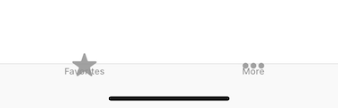
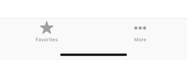

# UITabBar iPhoneX problem

There is a problem with `UITabBar` used without `UITabBarController` on iPhone X. The `UITabBar` layout is broken:



Layout can be fixed using following workaround:

```
    private var didLayoutSubviewsForTheFirstTime = false
    override func viewDidLayoutSubviews() {
        if !didLayoutSubviewsForTheFirstTime {
            didLayoutSubviewsForTheFirstTime = true
            tabBar.invalidateIntrinsicContentSize()
            view.setNeedsLayout()
        }
    }
```

So the layout is correct again:


